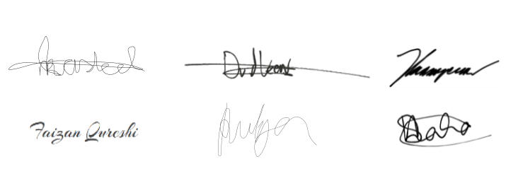

#### **Module 5 - Computer Systems (2021-22)**  

#### **Project**

##### **Team Contract**

| Team ID: | Project Title: | Mentor(s): |
| -------- | -------------- | ---------- |
| Group 42 | T.W.I.P | Alexandru Matco & Marten Voorberg |

**					**

1. **Team information and their roles (What are the convenient Belbin roles for you? Mention at least 2 roles)**

   The Belbin roles are Resource Investigator, Team-worker and Coordinator (the Social roles); Plant, Monitor Evaluator and Specialist (the Thinking roles), and Shaper, Implementer and Completer Finisher (the Action or Task roles) (refer to the link for a better understanding: <https://www.belbin.com/about/belbin-team-roles> ) 

|**Name of the Team member**|**Preferred roles (Belbin)**|**Reason to select your preference (Any special expertise on your preference?)**|**Grade expectations** | |**Preferable day, time, and place to have extra meetings**|**Scrum Master (Week number)**|**Preferred method of communication           for project discussion/informing any relevant updates to your team.**|
| - | - | - | - | - | - | - | :- |
||||**Minimum grade**|**Expected grade**||||
| 1. Mila Kasteel | Complete Finsher, Team Worker & Coordinator |Experience in Front-end, very precise and a perfectionist. | 5.5 | 7 |Day and time don't matter as long everyone is available. I prefer Discord. | 2-3 | Discord & Whatsapp |
| 2. Egor Krasnoperov | Plant & Resource Investigator | Never-ending stream of (sometimes good) ideas, good with Google. | 6.5 | 7.5 | Not on weekend, Monday or Wednesday evenings. | 5-6 | Discord & Whatsapp |
| 3. Rutger Witmans | Monitor Evaluator & Security Officer | I filled in the Belbin role test and got this as result. | 5.5 | 7.0 | As long as the time is available and everyone is there I am happy. | 1-2 | Discord & WhatsApp | 
| 4. Daan van der Veen | Plant & Resource Invesigator | Past extensive experience in idea generation and tinkering with potential concepts and ideas, as well as determining requirements based stakeholders. | 6.5 | 7.5 | Afternoons in the weekend and during unsupervised self-study planned hours. | 3-4 | Either via Discord/Whatsapp or in physical meetings. |
| 5. Novojit Saha | Innovator & Driver | I filled in the Belbin role test and got this as result. | 7.5 | 8.5 | Anytime during the weekends. | 4-5 | Discord & WhatsApp | 
| 6. Faizan Qureshi |Coordinator and Innovator |Experience in Front-end, knowledge about most Front-end requirments. |6.5 |7.5 |Monday's, Wednesday's, Friday's and mostly on weekends also. | 5-6 | Discord & Whatsapp | 
 

2. **Project Goals (Mention at least 5)**

   What are your team goals for the project? What do you want to achieve? What skills do you want to improve or work?

   - *To develop a product that is secure from malicious attacks.*
   - *To gain a better grasp of low level programming.*
   - *To create a product that we are all proud of.*
   - *To create something that we are able to use for a better life experience.*
   - *To get a better feel for using sensors in future projects.*
 

3. **Team Expectations (Mention at least 3 for each of the criteria)**

   What do you expect from the team members for the a) Participation, b) Meetings, c) Communication, d) Conduct, and e) Conflict

| a) **Participation (What is your group planning for team participation?):** |
| ------------------------------------------------------------ |
| *As a project team:* |
| - *We agree to participate in all planned meetings.* |
| - *We agree to not be late in the meetings.* |
| - *We agree to do all enough for the project to produce a good result at the end.*              |

| b) **Meetings (What is your expectation from the team for the team meetings?):** |
| ------------------------------------------------------------ |
| *As a project team:* |
| - *We agree to pay full attention to each other during the meetings.* |
| - *We agree to let people have a turn to speak.* |
| - *We agree to stay objective during meetings.*              |

| c) **Communication (How do you communicate with each other? Any rules for communication?):** |
| ------------------------------------------------------------ |
| *As a project team:* |
| - *We agree to keep shitposting to a sensible degree.* |
| - *We agree to keep discussions within the group civilized.* |
| - *We agree to make any decisions as a group and discuss potential disagreements to find the best solution.*             |

| d) **Individual Accountability (What is your expectation level for each individual in your team for fulfilling team assignments, tasks, and accomplishing deadlines?):** |
| ------------------------------------------------------------ |
| *As a project team:* |
| - *We agree to that everyone is responsible for his/her task.*  |
| - *We agree that we will help each other on difficult tasks and ask each other for help when we need it.* |
| - *We agree to be up to date with the submission deadlines.*               |
| - *We agree to keep our team up to date with the progress.*               |

| e) **Conduct (How do you follow the degree of professionalism within the team and how do you manage if any of the team members doesn’t follow the conduct or fails to fulfill expectations?):** |
| ------------------------------------------------------------ |
| *As a project team :* |
| - *We agree to make no discrimination towards teammembers in any way.* |
| - *We agree to respect each others opinion and be open to discussions.* |
| - *We agree to let each other know in advance if we will be absent during the meeting, ideally by more than 24 hours.* |
| - *We agree to talk in English, to make sure no one is excluded from conversation.*            |

| f) **Conflict (How do you handle or how will you react to team conflicts?):** |
| ------------------------------------------------------------ |
| *As a project team:*  |
| - *We agree to help the people in conflict and try to work it out.* |
| - *We agree to resolve the conflict as a team if two team members can not.* |
| - *We agree to contact our project mentros when we do not solve the problem.*             |
 

4. **Team Agreements (These are the final 10 commitments/rules for your team that you agreed on together and promise to follow these rules during the project, Course: Computer Systems, Module 5 (2021-22).** 

   I undersigned, hereby declare that I have read, agreed, and accepted all the rules and commitments mentioned in this document and will try my best to follow these rules during the project, Course: Computer Systems, Module 5 (2021-22). If the rules are not being followed by us, we will bear the consequences as mentioned.

|**Commitments (C)**|**A signal on your commitments (Yes/No)**|**Team Member’s Signature (Image)**|
| :- | :-: | :- |
||Member 1, Member 2, Member 3, Member 4, Member 5, Member 6||
|*i). As a team member, I agree to be on time for meetings and pay attention to the meeting.* |Yes| |
|*ii). As a team member, I agree to respect my teammates' opinions and allow them to speak and discuss with me and the other team members.*|Yes||
|*iii). As a team member, I will take responsibility for the quality of the project work.*|Yes||
|*iv). As a team member, I will provide updates about my work and progress to my team members and communicate any difficulties I find.*|Yes||
|*v). As a team member, I agree to resolve conflict between people as a group.*|Yes||
|*vi). As a team member, I will ask for help whenever I am stuck on a problem.*|Yes||
|*vii). As a team member, I will listen and then try to implement their suggestions if appropriate and applicable if I receive feedback form my fellow team members.*|Yes||
|*viii). As a team member, I will try to discuss with the rest of the team members if I have any problems with a fellow member so we can move forward in the future.*|Yes||
|*ix). As a team member, I will adhere to the scrum methodology.*|Yes||
|*x). As a team member, I will never be afraid of learning new things to improve productivity.*|Yes||

